# Chapter 1 

- most fundamental abstraction --> process --> a running program --> instructions of the program (code) also sits in the disk ( memory)
- mechanism --> low level thing to achieve stuff like context swiching , policies --> high level algos for achieving the same 
- machine state: what a program can read or update when it is running. At any given time, what parts of the machine are important to the execution of this program?
- parts of machine state --> obv memory , registers.
- **Process API** --> there should a method to create , destroy , wait , know status of the Process
- before creating any process , the os must place the instructions and the static variables in the disk and it must allocate some memory for the run time stack and heap also some io tasks
- process status --> running ready blocked(for ex io operations)

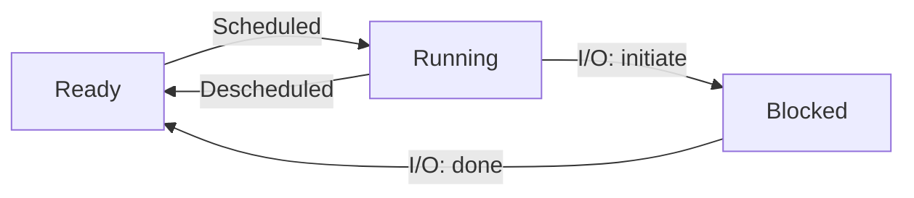


| Time      | 1       | 2       | 3       | 4                  | 5       | 6       | 7       | 8                  |
| --------- | ------- | ------- | ------- | ------------------ | ------- | ------- | ------- | ------------------ |
| Process0  | Running | Running | Running | Running            | –       | –       | –       | –                  |
| Process1  | Ready   | Ready   | Ready   | Ready              | Running | Running | Running | Running            |
| **Notes** |         |         |         | Process 0 now done |         |         |         | Process 1 now done |


- the OS likely will keep some kind of process list for all processes that are ready and some additional information to track which process is currently running.

### Process Context Structure (`struct context`)
This structure saves the CPU registers needed to stop and restart a process during context switching.

```c
struct context {
    int eip;  // Instruction pointer (next instruction to execute)
    int esp;  // Stack pointer (points to the top of the stack)
    int ebx;  // Base register
    int ecx;  // Counter register
    int edx;  // Data register
    int esi;  // Source index for data operations
    int edi;  // Destination index for data operations
    int ebp;  // Base pointer (used for stack frame management)
};

enum proc_state { 
    UNUSED,   // Process slot is not in use
    EMBRYO,   // Process is being initialized
    SLEEPING, // Process is waiting for an event or resource
    RUNNABLE, // Process is ready to run
    RUNNING,  // Process is currently executing
    ZOMBIE    // Process has finished execution but is not yet cleaned up
};

struct proc {
    char *mem;                 // Start of process memory (includes code, data, and stack)
    uint sz;                   // Size of process memory in bytes
    char *kstack;              // Bottom of the kernel stack for this process
    enum proc_state state;     // Current state of the process
    int pid;                   // Unique process identifier
    struct proc *parent;       // Pointer to the parent process
    void *chan;                // Channel on which the process is sleeping (non-zero if sleeping)
    int killed;                // Flag indicating if the process has been marked for termination
    struct file *ofile[NOFILE]; // Array of pointers to the open file descriptors
    struct inode *cwd;         // Pointer to the current working directory inode
    struct context context;    // CPU context (registers) for the process during context switching
    struct trapframe *tf;      // Trap frame for handling system calls and interrupts
};
```


- exited but not cleaned up --> zombie state

## Process API's Practical Applications

### Fork()

```c
#include <stdio.h>
#include <stdlib.h>
#include <unistd.h>

int main(int argc, char *argv[]) {
    printf("hello world (pid:%d)\n", (int) getpid());

    int rc = fork();

    if (rc < 0) {
        // fork failed
        fprintf(stderr, "fork failed\n");
        exit(1);
    } else if (rc == 0) {
        // child (new process)
        printf("hello, I am child (pid:%d)\n", (int) getpid());
    } else {
        // parent goes down this path (main)
        printf("hello, I am parent of %d (pid:%d)\n", rc, (int) getpid());
    }

    return 0;
}

```

output of this 

```
hello world (pid:29146)
hello, I am parent of 29147 (pid:29146)
hello, I am child (pid:29147)

```


- note that the two process did not print hello world two times
- if rc == 0 then its a child process , if rc has a number than its a parent process but the number is the pid of the child process


## Wait()

```c
#include <stdio.h>
#include <stdlib.h>
#include <unistd.h>
#include <sys/wait.h>

int main(int argc, char *argv[]) {
    // Print initial message with the current process ID
    printf("Hello world (pid: %d)\n", (int)getpid());

    // Fork the current process
    int rc = fork();

    if (rc < 0) {
        // Fork failed; print an error message and exit
        fprintf(stderr, "Fork failed\n");
        exit(1);
    } else if (rc == 0) {
        // Child process
        printf("Hello, I am the child (pid: %d)\n", (int)getpid());
    } else {
        // Parent process
        int rc_wait = wait(NULL); // Wait for the child process to finish
        printf("Hello, I am the parent of %d (rc_wait: %d) (pid: %d)\n", 
               rc, rc_wait, (int)getpid());
    }

    return 0;
}
```


## exec()

```c
#include <stdio.h>
#include <stdlib.h>
#include <unistd.h>
#include <string.h>
#include <sys/wait.h>

int main(int argc, char *argv[]) {
    // Print initial message with the current process ID
    printf("Hello world (pid: %d)\n", (int)getpid());

    // Fork the current process
    int rc = fork();

    if (rc < 0) {
        // Fork failed; print an error message and exit
        fprintf(stderr, "Fork failed\n");
        exit(1);
    } else if (rc == 0) {
        // Child process
        printf("Hello, I am the child (pid: %d)\n", (int)getpid());

        // Arguments for the "wc" (word count) program
        char *myargs[3];
        myargs[0] = strdup("wc");       // Program name: "wc"
        myargs[1] = strdup("p3.c");    // Argument: file to count
        myargs[2] = NULL;              // Null-terminated array

        // Execute the "wc" program
        execvp(myargs[0], myargs);

        // This line should never be executed if execvp is successful
        printf("This shouldn’t print out\n");
    } else {
        // Parent process
        int rc_wait = wait(NULL);  // Wait for the child process to finish
        printf("Hello, I am the parent of %d (rc_wait: %d) (pid: %d)\n",
               rc, rc_wait, (int)getpid());
    }

    return 0;
}
```

```
Hello world (pid: 12345)
Hello, I am the child (pid: 12346)
      10      20     150 p3.c
Hello, I am the parent of 12346 (rc_wait: 12346) (pid: 12345)

```

so when this new program is loaded , is a new process created for it to run? no the child process is the one running it but 

> it loads code (and static data) from that executable and overwrites its current code segment (and current static data) with it; the heap and stack and other parts of the memory space of the program are re-initialized


# Limited Direct Execution

- **Basic Idea of Virtualization** --> run one process for a while and then run another process. 
#### Direct Execution Protocol (Without Limits)

| **Stage**        | **Action**                                                     |
|-------------------|---------------------------------------------------------------|
| **OS**           |                                                               |
| Process Creation  | Create an entry in the process list.                          |
| Memory Allocation | Allocate memory for the program.                              |
| Load Program      | Load program instructions into memory.                        |
| Stack Setup       | Set up the stack with `argc` and `argv`.                      |
| Clear Registers   | Reset CPU registers to avoid residual interference.           |
| Start Execution   | Call `main()` to begin program execution.                     |
| **Program**       |                                                               |
| Run `main()`      | Execute the code inside the `main()` function.                |
| Return from Main  | Return execution control and status to the OS.                |
| Free Memory       | Release allocated memory back to the OS.                      |
| Process Cleanup   | Remove process entry from the process list.                   |

---

#### Issues with Direct Execution Protocol

 1. **Ensuring OS Control**
- The OS must stay in control.
- The program should not access restricted OS areas or perform unethical actions.

 2. **Fair Process Scheduling**
- The program should not run indefinitely.
- The OS must switch processes fairly to prevent one from monopolizing resources.

 3. **System Efficiency**
- The system must efficiently manage resources and minimize overhead during process switching.


## Ensuring OS Control

- there are two modes 
   - User mode ( perform normal operations)
   - Kernal mode (special mode)

If you want to do any special task , you have to be in Kernel mode. but how do you go into Kernel mode? 

- using trap instructions and trap table ( a table of codes for which code correspondes to which special process) , when the special task is complete os issues a return from trap instruction which forcefully takes process back to user mode


![[Pasted image 20241216155830.png]]


## Switching Between Processes

### A Cooperative Approach

some old systems use this , see to switch between process , os should be running , but when a process is running os is not running at that time. so os can't retake control.

so what these old systems use to do , whenever a process did system call or asked for kernal mode , the os would regan control. 
or if any process try to do something illegal , which meant doing a illegal trap , and os would see that trap and know its illegal and then kill the process

### A Non-Cooperative Approach

The answer turns out to be simple and was discovered by a number
of people building computer systems many years ago: a timer interrupt
[M+63]. A timer device can be programmed to raise an interrupt every
so many milliseconds; when the interrupt is raised, the currently running
process is halted, and a pre-configured interrupt handler in the OS runs.


### Saving and Restoring Context

Now that the OS has regained control, whether cooperatively via a system call, or more forcefully via a timer interrupt, a decision has to be made: whether to continue running the currently-running process, or switch to a different one. This decision is made by a part of the operating system known as the scheduler; we will discuss scheduling policies in
great detail in the next few chapters.

If the decision is made to switch, the OS then executes a low-level piece of code which we refer to as a context switch. A context switch is conceptually simple: all the OS has to do is save a few register values for the currently-executing process (onto its kernel stack, for example) and restore a few for the soon-to-be-executing process (from its kernel
stack). By doing so, the OS thus ensures that when the return-from-trap instruction is finally executed, instead of returning to the process that was running, the system resumes execution of another process.


# Scheduling Policies

#### Assumptions

1. Each job runs for the same amount of time.
2. All jobs arrive at the same time.
3. Once started, each job runs to completion.
4. All jobs only use the CPU (i.e., they perform no I/O)
5. The run-time of each job is known.

we will keep relaxing the assumptions as we go towards more perfect scheduling

#### Metrics

**TurnAround Time**

Tturnaround = Tcompletion − Tarrival.
Because we have assumed that all jobs arrive at the same time, for now
Tarrival = 0 and hence Tturnaround = Tcompletion .

You should note that turnaround time is a performance metric, which
will be our primary focus this chapter. Another metric of interest is fair-
ness

### First in First out

suppose three processes (A,B,C) come together (assumption 1) and run for the same time 10 seconds. now A comes just before B and B comes just before C like really really small time gaps.

![[Pasted image 20241217120504.png]]


Thus, the average turnaround time for the three jobs is simply (10+20+30)/2=20.

Now let’s relax one of our assumptions. In particular, let’s relax assumption 1, and thus no longer assume that each job runs for the same amount of time. How does FIFO perform now? What kind of workload could you construct to make FIFO perform poorly?

![[Pasted image 20241217120809.png]]

This problem is generally referred to as the convoy effect

It turns out that a very simple approach solves this problem , **Shortest Job First**

Let’s relax another. In particular, we can target assumption 2, and now assume that jobs can arrive at any time instead of all at once. What problems does this lead to?

![[Pasted image 20241217121053.png]]

### Shortest Time-to-Completion First (STCF)

To address this concern, we need to relax assumption 3 (that jobs must run to completion)

![[Pasted image 20241217121341.png]]

Any time a new job enters the system, the STCF scheduler determines which of the remaining jobs (including the new job) has the least time left, and schedules that one.

### A New Metric: Response Time

However, the introduction of time-shared machines changed all that. Now users would sit at a terminal and demand interactive performance from the system as well. And thus, a new
metric was born: response time.

We define response time as the time from when the job arrives in a
system to the first time it is scheduled.

![[Pasted image 20241217122508.png]]

imagine sitting at a terminal, typing, and having to wait 10 seconds
to see a response from the system just because some other job got sched-
uled in front of yours: not too pleasant.


### Round Robin

The basic idea is simple: instead of running jobs to completion, RR runs a job for a time slice (sometimes called a scheduling quantum) and then switches to the next job in the run queue

the length of a time slice must be a multiple of the timer-interrupt period; thus if the timer interrupts every 10 milliseconds, the time slice could be 10, 20, or any other multiple of 10 ms.

However, making the time slice too short is problematic: suddenly the cost of context switching will dominate overall performance

Note that the cost of context switching does not arise solely from the OS actions of saving and restoring a few registers. When programs run, they build up a great deal of state in CPU caches, TLBs, branch predictors, and other on-chip hardware. Switching to another job causes this state to be flushed and new state relevant to the currently-running job to be
brought in, which may exact a noticeable performance cost

We have developed two types of schedulers. The first type (SJF, STCF) optimizes turnaround time, but is bad for response time. The second type (RR) optimizes response time but is bad for turnaround. And we still have two assumptions which need to be relaxed: assumption 4 (that jobs do no I/O), and assumption 5 (that the run-time of each job is known). Let’s tackle those assumptions next.

## Incorporating I/O

assume we have two jobs, A and B, which each need 50 ms of CPU time. However, there is one obvious difference: A runs for 10 ms and then issues an I/O request.

![[Pasted image 20241217200215.png]]

## The Multi-Level Feedback Queue

it's time to relax our final assumption.

the MLFQ has a number of distinct queues, each assigned a different priority level. At any given time, a job that is ready to run is on a single queue. MLFQ uses priorities to decide which job should run at a given time: a job with higher priority (i.e., a job on a
higher queue) is chosen to run. Of course, more than one job may be on a given queue, and thus have the same priority. In this case, we will just use round-robin scheduling among those jobs.

Thus, we arrive at the first two basic rules for MLFQ:

• **Rule 1**: If Priority(A) > Priority(B), A runs (B doesn’t).
• **Rule 2**: If Priority(A) = Priority(B), A & B run in RR.

![[Pasted image 20241217201502.png]]

now according to this figure A and B will run in R.R , but C and D will never get to run. Actually MLFQ changes priorities over time , lets figure out how it does it.

we must keep in mind our workload: a mix of interactive jobs that are short-running (and may frequently relinquish the CPU), and some longer-running “CPU-bound” jobs that need a lot of CPU time but where response time isn’t important.

• **Rule 3**: When a job enters the system, it is placed at the highest
priority (the topmost queue).

• **Rule 4a**: If a job uses up an entire time slice while running, its pri-
ority is reduced (i.e., it moves down one queue).

• **Rule 4b**: If a job gives up the CPU before the time slice is up, it stays
at the same priority level.

#### Flaws with this approach

- if there are “too many” interactive jobs in the system, they will combine to consume all CPU time, and thus long-running jobs will never receive any CPU time
- a smart user could rewrite their program to game the scheduler. before the slice time is over use io.
- Finally, a program may change its behavior over time; what was CPU-bound may transition to a phase of interactivity.

**Rule 5**: After some time period S, move all the jobs in the system
to the topmost queue.

This solves problem 1 and problem 3.


# Memory

- earlier these used to run only 1 process at a time , so things were easy , some memory was reserved for the os and other was allocated to the process running at that time but later users started asking for interectivity , running multiple processes at the same time, so one solution could be 

> One way to implement time sharing would be to run one process for ashort while, giving it full access to all memory (Figure 13.1), then stop it, save all of its state to some kind of disk (including all of physical memory), load some other process’s state, run it for a while, and thus implement some kind of crude sharing of the machine [M+63]. Unfortunately, this approach has a big problem: it is way too slow, particularly as memory grows. While saving and restoring register-level state (the PC, general-purpose registers, etc.) is relatively fast, saving the entire contents of memory to disk is brutally non performant. Thus, what we’d rather do is leave processes in memory while switching between them, allowing the OS to implement time sharing efficiently.


![[Pasted image 20241219125717.png]]


However, we have to keep those pesky users in mind, and doing so
requires the OS to create an easy to use abstraction of physical memory.
We call this abstraction the address space, and it is the running program’s
view of memory in the system.

![[Pasted image 20241219130700.png]]

Of course, when we describe the address space, what we are describing is the abstraction that the OS is providing to the running program. The program really isn’t in memory at physical addresses 0 through 16KB; rather it is loaded at some arbitrary physical address(es).

**Goal 1** 
the program shouldn’t be aware of the fact that memory is virtualized; rather, the program behaves as if it has its own private physical memory.

**Goal 2**
Another goal of VM is efficiency. both in terms of speed and space.

**Goal 3**
Finally, a third VM goal is protection. The OS should make sure to protect processes from one another as well as the OS itself from processes


**on each and every memory reference, an address translation is performed by the hardware to redirect application memory references to their actual locations in memory.**

#### Assumptions

- User's address space must be placed contiguously in physical memory.
- Address space size is smaller than physical memory.
- All address spaces are of the same size.

### Base and Bounds (Dynamic Relocation)

- **Dynamic Relocation**: Hardware-based address translation introduced in the 1950s.
- **Components**:
  - **Base Register**: Starting physical address of a process.
  - **Bounds Register**: Size or limit of the process's address space.
- **Translation**:
  - Virtual Address → Physical Address using:
  - physical address = virtual adress + base
- **Protection**:
  - Ensures addresses are within bounds; raises exceptions for violations.
  - Prevents illegal access to other processes or OS memory.
- **Runtime Relocation**:
  - Allows address spaces to move dynamically.
- **Example**:
  - Base = 32 KB, Bounds = 16 KB, Virtual Address = 15 KB → Physical Address = 47 KB.

## Segmentation

although the space between the stack and heap is not being used by the process, it is still taking up physical memory when we relocate the entire address space somewhere in physical memory; thus, the simple approach of using a base and bounds register pair to virtualize memory is wasteful. It also makes it quite hard to run a program when the entire address space doesn’t fit into memory; thus, base and bounds is not as flexible as we would like.

- Instead of a single base and bounds pair, use one for each logical segment of the address space.
- A segment is a contiguous portion of the address space with a specific length.
- Typical segments in the address space include code, stack, and heap.
- Segmentation enables the OS to place each segment in different parts of physical memory.


![[Pasted image 20241220152828.png]]

As you can see from the picture, the top two bits (01) tell the hardware which segment we are referring to. The bottom 12 bits are the offset into the segment: 0000 0110 1000, or hex 0x068, or 104 in decimal. Thus, the hardware simply takes the first two bits to determine which segment register to use, and then takes the next 12 bits as the offset into the segment. By adding the base register to the offset, the hardware arrives at the final physical address.

**offset means at what address are you looking for or refrencing**

![[Pasted image 20241220153359.png]]


**Look stack is growing in negetive direction**

- The stack grows backward in physical memory, requiring hardware to track growth direction (positive or negative).
- Negative growth translation involves calculating offsets by subtracting the maximum segment size from the virtual address offset.
- The physical address is derived by adding the negative offset to the base, with bounds checks ensuring offsets remain within the segment size.

#### OS Challanges

- **Context Switches**: The OS must save and restore segment registers to manage each process's unique virtual address space.
- **Segment Growth**: The OS handles requests like `malloc()` or `sbrk()` to grow segments by allocating more space and updating segment size registers, but can deny requests if memory is insufficient.
- **External Fragmentation**: Free space becomes scattered, making it hard to allocate or grow segments despite available memory.
- **Compaction**: Rearranges memory to create contiguous free space but is resource-intensive and complicates segment growth.

#### Free Space Management 

* Fixed-size space management is simple: maintain a list, return first available unit

* Variable-size space management is complex due to external fragmentation - free space gets divided into different-sized chunks

* External fragmentation can cause allocation failures even when total free space > request size, if no single contiguous block is large enough

### Machanisms

Imagine you're a memory manager and you have a 30-byte piece of land (memory). Initially, it's all free:


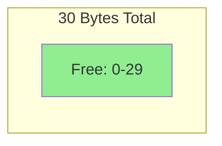


Now someone comes and asks for 10 bytes in the middle. After allocation, your land looks like this:

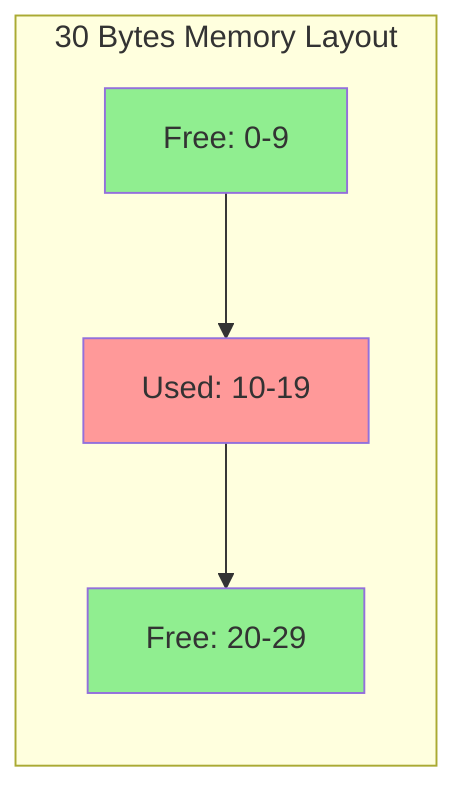


To keep track of free spaces, you maintain a list (like a chain of notes) pointing to free areas:

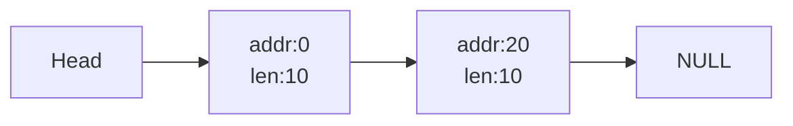


Now comes the interesting part! Someone asks for just 1 byte. This is where "splitting" happens:

- You look at your free list and decide to use the second chunk (at address 20)
- You split it into two parts: 1 byte for the request and 9 bytes remain free
- Your list now shows this new reality:
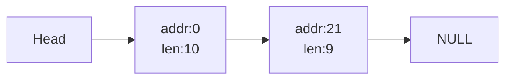


But wait! When the middle chunk (10-19) gets freed, something magical called "coalescing" happens:

- Without coalescing, your list would look messy , your compiler will still think of it as 3 blocks of 10 bites and if someone ask for 11 bytes it would fail :


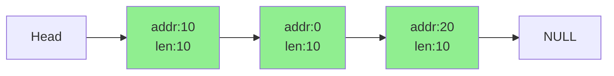


After coalescing (merging adjacent free spaces), you're back to where you started:

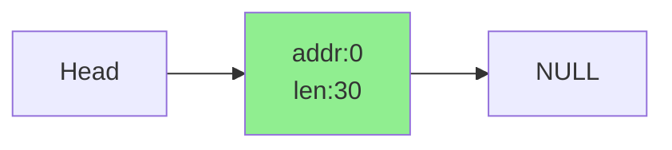

Key Lessons from our story:

- Splitting helps when someone asks for less memory than your free chunks
- Coalescing prevents memory fragmentation by combining adjacent free spaces
- Without coalescing, you might say "no" to a request for 20 bytes even when you have 30 free bytes (just not continuous)
- The free list helps you keep track of all available spaces, making it easier to manage memory efficiently

---


**The Problem: When someone calls free(void *ptr), they don't tell us the size. How do we know how much memory to free?

First, let's see our basic memory structure:

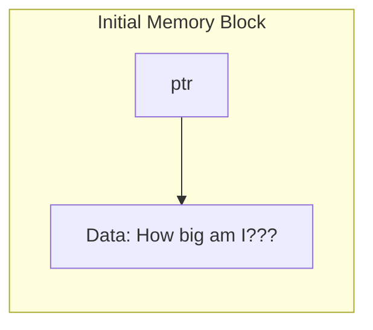
The Solution: We'll add a secret header just before the actual memory block!

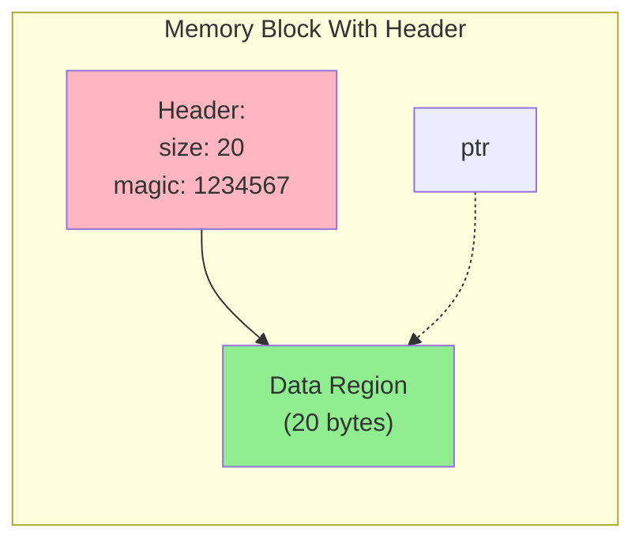

Now, when someone calls malloc(20), here's what actually happens behind the scenes:

1. We allocate 28 bytes (20 + 8 for header)
2. Fill the header with size and a magic number
3. Return ptr to the data region

When free(ptr) is called:
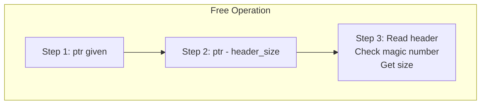

But wait! We need to track all our free spaces too. Here's where it gets clever - we'll build our tracking system INSIDE the free space itself:

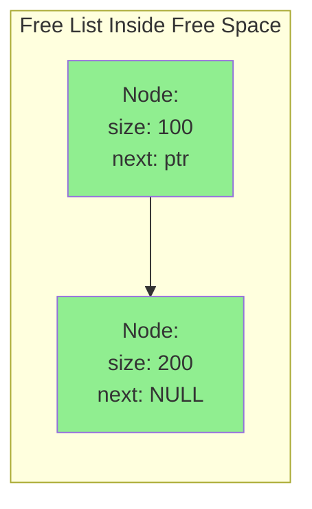

Let's see this in action with a 4KB memory chunk:
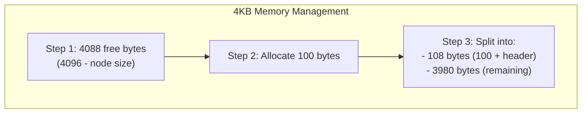

When we free memory, it goes back into our free list:

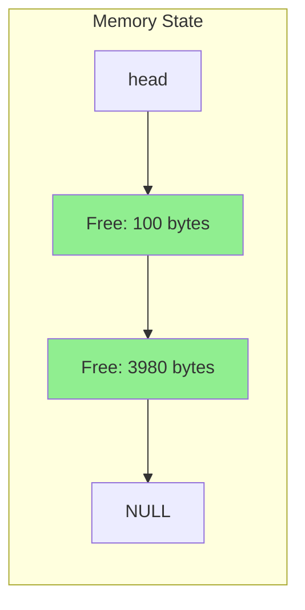

Key points in our solution:

1. Headers store crucial block information
2. We can find header from data pointer using simple subtraction
3. Free list is built inside free memory - no extra space needed!
4. Magic numbers help catch memory corruption

Without this system:

- We couldn't track memory block sizes
- Couldn't find adjacent blocks for coalescing
- Would waste memory on separate tracking structures

---

**Problem**: How do we know if someone accidentally (or maliciously) tries to free memory that wasn't allocated by malloc, or if they corrupt our memory headers?

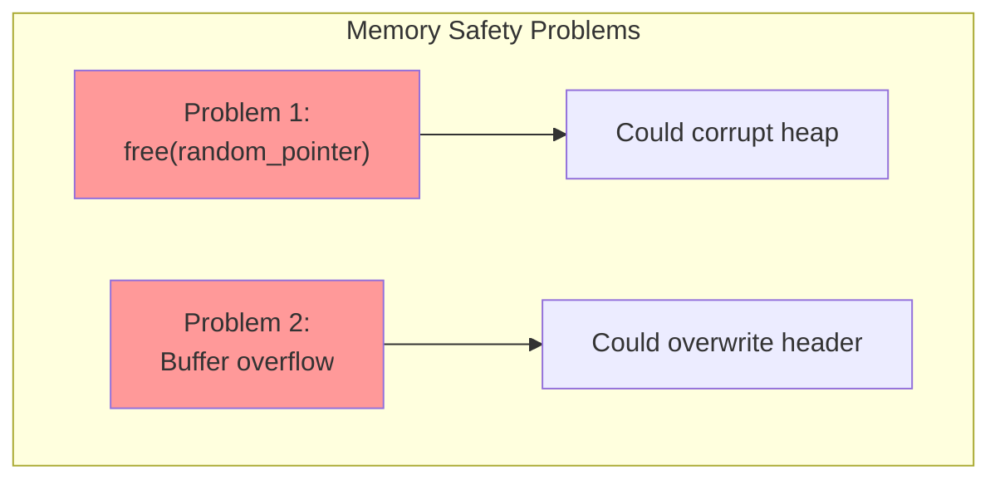
Solution: Add a magic number (like 1234567) to our header

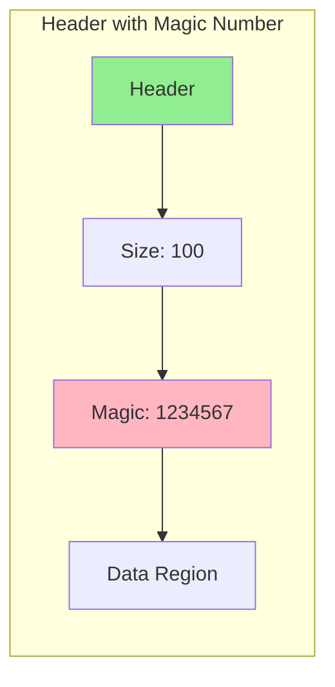
Now, when someone calls free(ptr), we can do a safety check:
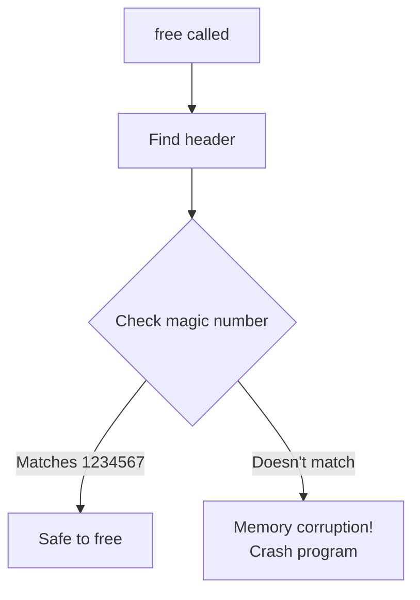


---

- Best Fit: Searches entire list and uses smallest block that fits the request - minimizes waste but slow due to full search.
- First Fit: Uses first block that's big enough - faster but can fragment the start of list with small leftover chunks.
- Next Fit: Like First Fit but continues from where it left off last time - spreads fragmentation throughout the list.
- Worst Fit: Always uses largest available block - aimed to leave large chunks but performs poorly and requires full list searc
---

## Paging

- Memory management can use variable-sized chunks (like segmentation) but faces fragmentation issues
- Alternative is fixed-size chunks (paging) where both virtual memory and physical memory are divided into equal units called pages and page frames respectively

![[Pasted image 20241222114413.png]]

![[Pasted image 20241222114431.png]]

the OS keeps a free list of all free pages for this, and just grabs the first four free pages off of this list.

Page table: Per-process structure mapping virtual pages to physical frames (e.g., VP0→PF3, VP1→PF7, VP2→PF5, VP3→PF2)

Page table is process-specific (each process has its own virtual-to-physical mappings) except for inverted page tables

- Virtual address split into: Virtual Page Number (VPN) + Offset
    - Example: In 64-byte address space (6 bits), with 16-byte pages:
    - First 2 bits = VPN (to select among 4 pages)
    - Last 4 bits = Offset (to select byte within 16-byte page)
- Translation process:
    - Take VPN from virtual address
    - Look up corresponding Physical Frame Number (PFN) in page table
    - Combine: PFN + original offset = physical address
- Practical example:
    - Virtual address 21 (010101 in binary)
    - VPN = 01, Offset = 0101
    - Page table maps VPN 1 → PFN 7
    - Final physical address = 1110101 (117 decimal)


- TLB (Translation-Lookaside Buffer) is a hardware cache in the MMU that stores frequently used virtual-to-physical address translations for faster access.
- On memory reference: Hardware first checks TLB for translation. If found (TLB hit), physical address is formed quickly by combining page frame number with offset.
- On TLB miss: Hardware must access page table in memory, verify access permissions, update TLB with translation, then retry instruction - significantly slower due to extra memory access.

## Paging: Smaller Tables

linear page tables get pretty big. Assume again a 32-bit address space (232 bytes), with 4KB (212 byte) pages and a 4-byte page-table entry. An address space thus has roughly 32 one million virtual pages in it ( 2212 ); multiply by the page-table entry size and you see that our page table is 4MB in size. Recall also: we usually have one page table for every process in the system! With a hundred active processes (not uncommon on a modern system), we will be allocating hundreds of megabytes of memory just for page tables! As a result, we are in search of some techniques to reduce this heavy burden.

![[Pasted image 20250101181238.png]]

![[Pasted image 20250101181255.png]]

- so many empty spaces in page table so space getting wasted solution 2 fix this.
- yarr but i have a doubt ek coloumn or badha dete or virtual page address bhi store krlete ye bt hi nhi ati


**solution 1** --> bigger page tables , he major problem with this approach, however, is that big pages lead to waste within each page, a problem known as internal fragmentation

**solution2**
![[Pasted image 20250101180818.png]]

**solution 3**  Multi page tables

![[Pasted image 20250101183029.png]]


Thus far, we’ve assumed that an address space is unrealistically small and fits into physical memory. In fact, we’ve been assuming that every address space of every running process fits into memory. We will now relax these big assumptions, and assume that we wish to support many concurrently-running large address spaces

The operating system uses hard disk drive as a slower but larger storage extension to main memory, allowing it to store less-frequently needed parts of address spaces (this is essentially describing the concept of swap space/virtual memory)

- **Reserve disk space**: Used for moving pages in and out of memory.
- **Swap space**: Space where pages are swapped between memory and disk.
- **Page-sized units**: OS reads and writes in page-sized units.
- **Disk address**: OS needs to track the disk address for each page.
- **Swap space size**: Determines the maximum number of memory pages in use.
- **Assumption**: Assume swap space is large for simplicity.

- Page Lookup: Hardware checks the Page Table Entry (PTE) during memory access.
- Present Bit Check:
    - Present Bit = 1: Page is in physical memory; proceed normally.
    - Present Bit = 0: Page is not in physical memory, indicating it's on disk.
- Page Fault: Accessing a page not in physical memory triggers a page fault.

Upon a page fault, the OS is invoked to service the page fault. A particular piece of code, known as a page-fault handler

- OS uses PTE bits to store the disk address.
- On page fault, OS retrieves the disk address from the PTE.
- OS issues a disk request to load the page into memory.
- When disk I/O completes, OS updates the page table.
- Process is blocked during disk I/O.
- OS runs other ready processes while servicing the page fault.

- Assume free memory is available to bring in a page from swap space.
- If memory is full or nearly full, the OS needs to free up space.
- OS pages out one or more pages to make room for new pages.
- The process of selecting a page to remove is called the page-replacement policy.

- OS typically keeps some memory free proactively.
- High watermark (HW) and low watermark (LW) guide page eviction.
- If free memory drops below LW, a background thread starts evicting pages.
- The thread continues until free memory reaches HW.
- This thread is often called the swap daemon or page daemon.
- Once HW is reached, the thread goes to sleep until needed again.

- Goal of replacement policy: Minimize cache misses to reduce disk fetches.
- Example scenario: Only virtual page 3 is not in memory.
- Memory reference behavior: `hit, hit, hit, miss, hit, hit, hit, hit, hit, hit`.
- Hit rate: 90% (9 out of 10 references found in memory).
- Miss rate: 10% (`PHit + PMiss = 1.0`).
- AMAT calculation:
    - Memory access time (`TM`): 100 nanoseconds.
    - Disk access time (`TD`): 10 milliseconds.
    - AMAT = `TM + PMiss × TD = 100ns + 0.1 × 10ms = 1ms`.
- With 99.9% hit rate (`PMiss = 0.001`), AMAT = `10.1 microseconds`.
- As hit rate approaches 100%, AMAT approaches 100 nanoseconds.


-  Optimal replacement policy: Replace the page that will be accessed furthest in the future.
- Intuition: Evict the least immediately needed page to prioritize other pages.
- Reason: All other pages will be accessed sooner than the evicted page.
- Limitation: Future access patterns are unknown, making implementation impractical for general-purpose systems.

**solution 1 : FIFO**
- ![[Pasted image 20250101201105.png]]

solution 2 --> random

Solution 3 --> LRU
- Page-replacement policies can use historical information to decide which page to replace.
- Frequency: Pages accessed many times are considered valuable and less likely to be replaced.
- Recency: Pages accessed recently are assumed more likely to be accessed again.
- LRU (Least Recently Used): A policy based on recency, replacing the least recently accessed page.

- When memory demands exceed available physical memory, the system becomes oversubscribed.
- This leads to constant paging, known as thrashin

## Concurrency

- A thread's state is similar to a process's state.
- Each thread has a program counter (PC) and a private set of registers.
- Switching between threads on a single processor requires a context switch.
- Context switch steps:
    - Save the register state of the current thread (T1).
    - Restore the register state of the next thread (T2).
- Thread context switches use thread control blocks (TCBs) to save state, similar to process control blocks (PCBs) for processes.
- Key difference: Address space remains the same during thread switches (no page table switch needed).
- Each thread in a multi-threaded process has its own stack.
-  Threads are ideal for programs requiring shared data structures.
- Processes are better for separate tasks with minimal data sharing.


- Two threads try to increment a shared counter 10 million times each.
- Expected result: counter = 20,000,000.
- Sometimes, the program works as expected: counter = 20,000,000.
- Other times, the result is incorrect (e.g., counter = 19,345,221).

**Reason for the Issue: Uncontrolled Scheduling**

- Compiler generates assembly code for incrementing `counter`:
    - `mov 0x8049a1c, %eax` (load `counter` into `eax`).
    - `add $0x1, %eax` (increment `eax` by 1).
    - `mov %eax, 0x8049a1c` (store `eax` back into `counter`).
- Problem arises due to thread context switching during this sequence.

**Example Scenario**

1. **Thread 1**
    
    - Loads `counter` value (e.g., 50) into `eax`: `eax=50`.
    - Increments `eax` by 1: `eax=51`.
    - Context switch occurs; `Thread 1` pauses.
2. **Thread 2**
    
    - Loads `counter` value (still 50) into `eax`: `eax=50`.
    - Increments `eax` by 1: `eax=51`.
    - Stores `eax` back to `counter`: `counter=51`.
    - Context switch occurs; `Thread 2` pauses.
3. **Thread 1 Resumes**
    
    - Stores its `eax` value (51) back to `counter`: `counter=51`.

**Outcome**

- Both threads executed the increment operation.
- `counter` was incremented only once, not twice.

**Summary**

- The issue occurs because the increment operation is not atomic.
- Context switching interrupts the sequence, leading to race conditions.
- This problem needs synchronization mechanisms (e.g., locks or atomic operations) to ensure correctness.

This is called Race condition , so in **critical section**(where threds are accessing shared memory) you should have **atomicity**


# Persistance

disk sits far away from cpu , memory and graphic card sits closer

![[Pasted image 20250102133755.png]]


- Device interface includes three registers: status (read to check device state), command (write to start operations), data (write/read data).
- OS protocol:
    - Poll status until device is not busy.
    - Write data to data register.
    - Write command to command register to start the device.
    - Poll status again until device finishes operation.
- Polling wastes CPU cycles as it repeatedly checks device status.
- Programmed I/O (PIO) involves the CPU in data transfer, reducing efficiency.

- Interrupts may not be ideal for fast devices as handling them involves context switching, which can slow down the system.
- For fast devices, polling may be more efficient as the device is usually ready immediately.
- Interrupts are beneficial for slow devices as they allow the CPU to perform other tasks during I/O.
- Hybrid approach: poll initially, then use interrupts if the device is not ready, balancing efficiency.
- Network-related issues:
    - Excessive interrupts from high packet loads can cause livelock, preventing user-level processes from running.
    - Polling can provide better control in such scenarios, ensuring the system remains responsive.
- Interrupt coalescing:
    - Delays interrupt delivery to combine multiple events into one, reducing overhead.
    - Trade-off: longer delay increases request latency.

- CPU heavily involved in transferring data with PIO, handling each word individually.
- Leads to inefficient CPU usage, wasting time on trivial tasks.
- DMA offloads data movement tasks from CPU.
- OS programs DMA with source address, data size, and target device.
- DMA transfers data independently without CPU intervention.
- DMA raises an interrupt to inform OS upon completion.

**before**

![[Pasted image 20250102163113.png]]

**after**
![[Pasted image 20250102163133.png]]

- now that we have solved the efficiency problem lets now solve the communication problem how does os communicate with the drives

- Two main methods of device communication: explicit I/O instructions and memory-mapped I/O.
- Explicit I/O uses special instructions like `in` and `out` (e.g., on x86) to send data to device registers.
- These instructions are privileged, limiting direct device access to the OS for security.
- Memory-mapped I/O treats device registers as memory locations.
- OS reads/writes to these registers using standard memory load/store instructions.
- Hardware routes these memory operations to the device instead of main memory.
- Both methods are effective; memory-mapped I/O requires no additional instructions but both are widely used.

- To ensure OS device neutrality, the OS must hide the details of device interactions from major subsystems.
- This is achieved through abstraction, where a device driver encapsulates the specifics of interacting with the device.
- The OS interacts with a generic interface, such as the block layer in Linux, rather than being aware of the type of device.
- The file system or applications issue block read and write requests to the generic block layer.
- The block layer routes these requests to the appropriate device driver, which handles the actual device-specific operations.
- This abstraction allows the OS to work seamlessly with different types of drives without needing to know their details.

# Hard Disk

![[Pasted image 20250102171200.png]]

- Modern disk drives have a straightforward interface: they consist of a large number of sectors (512-byte blocks) that can be read or written. These sectors are numbered from 0 to n-1, representing the drive’s address space.
    
- Multi-sector operations are possible, with many file systems reading or writing data in larger chunks (e.g., 4KB or more). However, the only guarantee manufacturers make is that a 512-byte write is atomic. If an untimely power loss occurs, only part of a larger write may complete, leading to a "torn write."
    
- Some assumptions are made about disk drives, such as the speed of accessing blocks near each other being faster than accessing blocks that are far apart. Sequential access is typically faster than random access.
    
- Disks consist of platters, which are hard surfaces where data is stored persistently by inducing magnetic changes. Platters are made of materials like aluminum and are coated with a magnetic layer. Each platter may have two sides, known as surfaces, where data is stored.
    
- The platters are bound together around a spindle, which is connected to a motor that spins them at a constant rate, usually between 7,200 RPM to 15,000 RPM. The rotational speed affects the time taken for a full rotation (e.g., 10,000 RPM corresponds to a 6ms rotation time).
    
- Data is encoded on the surfaces in concentric circles called tracks. Each track contains sectors, with each surface having thousands of tracks. The disk head, mounted on a disk arm, moves across the surface to read or write data from the correct track.
    
- When accessing data, the disk may incur two main delays:
    
    - **Rotational delay (latency)**: Time spent waiting for the disk's rotation to bring the desired sector under the read/write head.
    - **Seek time**: Time spent moving the disk arm to the correct track.
- Seek time involves acceleration, coasting, deceleration, and settling phases. During settling, the head positions itself precisely over the correct track. Both seek time and rotational delay contribute significantly to disk I/O latency.
    
- Modern drives use track skew to ensure efficient sequential reads, even when crossing track boundaries. This means that when switching from one track to another, the head is repositioned so the next block is more likely to be under the head, reducing rotational delay.
    
- Disk drives often have a cache (track buffer) to store recently accessed data. This cache helps improve performance by allowing quick access to frequently requested data. Write-back caching can make the drive seem faster by acknowledging the write once it’s stored in memory, but it can lead to issues if the data must be written in a specific order for consistency.
    
- The outer tracks of a disk usually contain more sectors than inner tracks due to the geometry of the disk. Drives with multi-zoned layouts organize the disk into zones with consecutive tracks containing the same number of sectors. Outer zones have more sectors due to the larger physical space available.


![[Pasted image 20250102172817.png]]

- The OS decides the order of I/Os to optimize disk access due to the high cost of I/O.
- The disk scheduler examines and selects which I/O request to schedule next.
- Disk requests' time can be estimated based on seek and rotational delay, unlike job scheduling.
- The disk scheduler prioritizes requests that will take the least time to service, following the principle of shortest job first (SJF).

- The OS can implement nearest-block-first (NBF) scheduling, which picks the request with the nearest block address next.
- A more fundamental issue in disk scheduling is starvation, where certain requests might never be serviced if they are constantly outranked by others.


![[Pasted image 20250102175329.png]]

- Shortest Positioning Time First (SPTF), also known as Shortest Access Time First (SATF), aims to minimize positioning time.
- The problem involves deciding which request to prioritize based on seek time and rotational delay.
- Example: The disk head at sector 30 needs to decide between sector 16 (middle track) and sector 8 (outer track). The choice depends on:
    - If seek time dominates, servicing sector 16 (closer) is preferred.
    - If rotational delay dominates, servicing sector 8 (further but faster rotation) might be better.
- Modern drives balance seek and rotational delays, making SPTF effective.
- SPTF is complex to implement in an OS due to limited knowledge of disk specifics, so it's often handled within the drive itself.

- In older systems, the OS managed disk scheduling by selecting and issuing one request at a time to the disk.
- Modern systems allow disks to handle multiple outstanding requests with internal schedulers.
- The OS sends a batch of requests (e.g., 16) to the disk, which then optimizes their order based on internal details like head position.
- Disk schedulers merge adjacent requests to reduce overhead, such as combining requests for blocks 33 and 34 into one.
- Anticipatory disk scheduling sometimes delays issuing a request to wait for potentially better ones, improving efficiency.


## Raid

![[Pasted image 20250102181457.png]]


- RAID (Redundant Array of Inexpensive Disks) uses multiple disks to create faster, larger, and more reliable storage systems.
- A RAID system consists of multiple disks, memory (volatile and non-volatile), and processors for management.
- Advantages of RAID include:
    - Improved performance by parallelizing I/O across multiple disks.
    - Increased capacity to handle large datasets.
    - Enhanced reliability by tolerating disk failures with redundancy.
- RAID systems are transparent to the host system, appearing as a single large disk.
- The type of physical I/Os depends on the RAID level.
- For example, in a mirrored RAID system (two copies of each block on separate disks), two physical I/Os are required for every logical I/O.
- Volatile memory (e.g., DRAM) to buffer data during read/write processes.


- To compare RAID approaches, it is essential to define a fault model that outlines expected disk faults.
- RAIDs are designed to detect and recover from specific disk faults.
- The **fail-stop fault model** is a simple and commonly used assumption:
    - A disk can be in one of two states: **working** or **failed**.
    - A working disk allows all blocks to be read or written.
    - A failed disk is considered permanently inaccessible.
- Fault detection in the fail-stop model:
    - Disk failures are assumed to be easily and immediately detectable by RAID controllers.
- Complex faults not considered in this model:
    - **Silent failures**, such as undetected data corruption.
    - **Latent sector errors**, where a single block becomes inaccessible while the rest of the disk works.
- These more complex fault scenarios are addressed later in the discussion.

- Evaluating a RAID design involves analyzing its strengths and weaknesses across three key dimensions
- Capacity measures how much useful storage is available to clients
- Without redundancy, capacity is calculated as N multiplied by B, where N is the number of disks and B is the number of blocks per disk
- Mirroring, which stores two copies of data, reduces capacity to N multiplied by B divided by 2
- Parity-based schemes provide capacities that fall between these extremes
- Reliability assesses how many disk failures the RAID design can tolerate
- Focus is on entire disk failures, following the fail-stop fault model
- Performance evaluates how well the RAID handles workloads and depends significantly on workload characteristics
- Typical workloads are considered before comparing performance
- Three significant RAID designs are introduced: RAID Level 0 (striping), RAID Level 1 (mirroring), and RAID Levels 4/5 (parity-based redundancy)


## File System

- Files are linear arrays of bytes, accessible for reading and writing.
- Each file has a low-level name, often referred to as an inode number.
- Users are generally unaware of these low-level names.
- The OS does not interpret file contents but stores and retrieves data persistently.
- Directories are similar to files but contain lists of (user-readable name, low-level name) pairs.
- Example: A file named "foo" with inode number "10" is stored as ("foo", "10") in a directory.
- Directories can contain files or other directories, forming a hierarchy.
- The hierarchy starts with a root directory (`/` in UNIX-based systems).
- Pathnames use separators to specify sub-directories and files, e.g., `/foo/bar.txt`.
- Directories and files can have the same name if located in different parts of the hierarchy.
- File names often include two parts: an arbitrary name and an extension indicating type (e.g., `.c`, `.jpg`).
- Extensions are conventions and do not enforce file content type.
- Unified naming in UNIX simplifies access to files, devices, and other resources under a single directory tree.
- Naming systems are crucial for accessing and managing resources effectively.

- Use `open()` to create or open a file with specific flags and permissions.
- Example:
    
    ```c
    int fd = open("foo", O_CREAT | O_WRONLY | O_TRUNC, S_IRUSR | S_IWUSR);
    ```
    
- Flags:
    - `O_CREAT`: Create file if it doesn't exist.
    - `O_WRONLY`: Open in write-only mode.
    - `O_TRUNC`: Truncate existing file to zero bytes.
- Permissions:
    - `S_IRUSR`: File readable by owner.
    - `S_IWUSR`: File writable by owner.
- Returns a file descriptor (an integer) to access the file.
- File descriptors are private to each process.
- Example file descriptor management in `xv6`:
    
    ```c
    struct proc {
        struct file *ofile[NOFILE]; // Array of open files
    };
    ```
    
- `creat()` is equivalent to:
    
    ```c
    int fd = open("foo", O_CREAT | O_WRONLY | O_TRUNC);
    ```
    
- `creat()` is an older system call, now mostly replaced by `open()`.

- To read a file, use the `cat` program to display its contents. For example:
    
    ```
    prompt> echo hello > foo  
    prompt> cat foo  
    hello  
    ```
    
    - Here, `echo hello > foo` writes "hello" to the file `foo`.
    - `cat foo` displays the content of `foo`.
- The tool `strace` traces system calls made by a program. Example usage with `cat`:
    
    ```
    prompt> strace cat foo  
    open("foo", O_RDONLY|O_LARGEFILE)  
    read(3, "hello\n", 4096)  
    write(1, "hello\n", 6)  
    hello  
    read(3, "", 4096)  
    close(3)  
    ```
    
    - `open("foo", O_RDONLY|O_LARGEFILE)` opens `foo` for reading and returns file descriptor 3.
- File descriptors:
    
    - Standard input: 0
    - Standard output: 1
    - Standard error: 2
    - The first file opened in a process (like `foo`) typically gets file descriptor 3.
- The `read()` system call:
    
    - Reads data into a buffer (e.g., `"hello\n"`) using file descriptor 3.
    - Returns the number of bytes read (e.g., 6, including newline).
- The `write()` system call:
    
    - Outputs data to standard output (file descriptor 1).
    - In `strace`, you see `write(1, "hello\n", 6)` writing to the screen.
- After reading the file completely, `read()` returns 0, indicating the end of the file.
    
- The `close()` system call closes the file, releasing resources.
    
- Writing to a file involves:
    
    - Opening the file with write permissions (`O_WRONLY`).
    - Using `write()` to send data to the file.
    - Closing the file with `close()`.
- Use `strace` to trace file writes, such as when using the `dd` utility:
    
    ```
    prompt> dd if=foo of=bar  
    ```
    
    This demonstrates similar system calls for writing.


Here's the content formatted to maintain the original flow and sequence for better understanding:

---

**Reading And Writing, But Not Sequentially**

Thus far, we’ve discussed how to read and write files, but all access has been sequential; that is, we have either read a file from the beginning to the end, or written a file out from beginning to end.

Sometimes, however, it is useful to be able to read or write to a specific offset within a file; for example, if you build an index over a text document and use it to look up a specific word, you may end up reading from some random offsets within the document. To do so, we will use the `lseek()` system call. Here is the function prototype:

```c
off_t lseek(int fildes, off_t offset, int whence);
```

The first argument is familiar (a file descriptor). The second argument is the offset, which positions the file offset to a particular location within the file. The third argument, called `whence` for historical reasons, determines exactly how the seek is performed. From the man page:

- If `whence` is `SEEK_SET`, the offset is set to `offset` bytes.
- If `whence` is `SEEK_CUR`, the offset is set to its current location plus `offset` bytes.
- If `whence` is `SEEK_END`, the offset is set to the size of the file plus `offset` bytes.

As you can tell from this description, for each file a process opens, the OS tracks a “current” offset, which determines where the next read or write will begin within the file. Thus, part of the abstraction of an open file is that it has a current offset, which is updated in one of two ways:

1. When a read or write of `N` bytes takes place, `N` is added to the current offset.
2. Explicitly with `lseek`, which changes the offset as specified.

The offset is maintained in the `struct file`, as shown below:

```c
struct file {
    int ref;              // Reference count
    char readable;        // Is the file readable?
    char writable;        // Is the file writable?
    struct inode *ip;     // Pointer to the inode
    uint off;             // Current offset
};
```

These file structures represent all currently opened files in the system and are part of the **open file table**, managed as follows:

```c
struct {
    struct spinlock lock;
    struct file file[NFILE];
} ftable;
```

---

### Examples

1. **Sequential Reads**  
    Let’s track a process that opens a file (size: 300 bytes) and reads it sequentially in chunks of 100 bytes using the `read()` system call.

|**System Call**|**Return Code**|**Current Offset**|
|---|---|---|
|`fd = open("file", O_RDONLY);`|3|0|
|`read(fd, buffer, 100);`|100|100|
|`read(fd, buffer, 100);`|100|200|
|`read(fd, buffer, 100);`|100|300|
|`read(fd, buffer, 100);`|0|300|
|`close(fd);`|0|–|

- The current offset starts at `0` when the file is opened.
- It increments by `100` with each `read()`.
- A `read()` past the end of the file returns `0`, signaling EOF.

---

2. **Independent Offsets for Multiple Opens**  
    A process opens the same file twice and issues independent reads.

|**System Call**|**Return Code**|**OFT[10] Offset**|**OFT[11] Offset**|
|---|---|---|---|
|`fd1 = open("file", O_RDONLY);`|3|0|–|
|`fd2 = open("file", O_RDONLY);`|4|–|0|
|`read(fd1, buffer1, 100);`|100|100|0|
|`read(fd2, buffer2, 100);`|100|100|100|
|`close(fd1);`|0|–|100|
|`close(fd2);`|0|–|–|

- Each file descriptor (`fd1`, `fd2`) refers to a separate entry in the **open file table**, with independent offsets.

---

3. **Using `lseek` to Reposition Offset**  
    A process uses `lseek()` to set a specific offset before reading.

|**System Call**|**Return Code**|**Current Offset**|
|---|---|---|
|`fd = open("file", O_RDONLY);`|3|0|
|`lseek(fd, 200, SEEK_SET);`|200|200|
|`read(fd, buffer, 50);`|50|250|
|`close(fd);`|0|–|

- `lseek()` sets the offset explicitly to `200`.
- The subsequent `read()` starts from this new position and updates the offset accordingly.

---

This approach allows precise control over file access and is especially useful for random reads or writes in large files.

- In `fork()`, parent and child share the same open file table entry for inherited file descriptors, meaning changes to the file offset or writes by one affect the other.
- The file table entry uses a reference count to track shared usage and is only removed when all references are closed.
- `dup()` creates a new file descriptor pointing to the same file table entry, sharing the file offset and reference count with the original descriptor.
- These mechanisms enable processes to share access to files without extra coordination.


--- 
- Normally, `write()` buffers data in memory for performance, with the actual writing to disk happening later.
- In case of crashes before data is written to disk, data can be lost, but this is rare.
- Some applications (e.g., DBMS) need immediate persistence, requiring a call to `fsync()`.
- `fsync()` forces all dirty data for the given file descriptor to be written to disk immediately.
- After `fsync()` returns, the application can be confident the data is stored.
- To ensure data is fully persisted, especially for new files, it may also be necessary to call `fsync()` on the directory containing the file.

- Renaming a file is done using the `rename()` system call, which takes two arguments: the old name and the new name.
- The `rename()` call is typically atomic, meaning if the system crashes during renaming, the file will either have the old or new name, ensuring no partial state.
- This atomicity is useful in applications that require file updates without corruption, such as file editors.
- For example, a text editor may write a new version of a file under a temporary name, sync it to disk, and then rename the temporary file to the original file name. This guarantees a safe, atomic file update without risking partial changes.


- **Removing Files:** The `rm` command removes files by calling the `unlink()` system call. `unlink()` removes a link to a file in the file system, which is why it's named "unlink" instead of "remove" or "delete."
    
- **Why `unlink`?:** The system call is named `unlink` because it essentially removes the link (or reference) between the file name and its inode. The file data itself isn't removed until no more links (references) to the inode exist.
    
- **Creating Directories:** The `mkdir()` system call is used to create directories, which are initially empty except for two special entries: `.` (referring to the directory itself) and `..` (referring to its parent directory).
    
- **Reading Directories:** Directories can be read using `opendir()`, `readdir()`, and `closedir()` system calls, which return information about directory contents, such as file names and inode numbers.
    
- **Deleting Directories:** Directories can be deleted using `rmdir()`, but the directory must be empty first, containing only the `.` and `..` entries.
    
- **Hard Links:** The `link()` system call allows creating multiple references (hard links) to the same inode, making different file names point to the same underlying data. Removing one link doesn't delete the file data until all links are removed.
    
- **Reference Counting:** Each inode maintains a reference count, tracking how many file names (links) point to it. When `unlink()` is called, the reference count is decreased. When the reference count reaches zero, the file data is freed.

- Symbolic links (soft links) can link to directories and files across file systems, unlike hard links.
- Created using `ln -s` command.
- Symbolic link is a separate file that contains the pathname of the target file.
- Symbolic links are identified with an `l` in `ls -al` output.
- Size of a symbolic link corresponds to the length of the pathname.
- If the target file is deleted, the symbolic link becomes a dangling reference, unlike hard links.

- `mkfs` (make filesystem) creates a new, empty filesystem on a disk partition (e.g., `/dev/sda1`), starting with a root directory.
- `mount` integrates the new filesystem into the directory tree at a specified mount point.
- Example: Mounting `/dev/sda1` with an ext3 filesystem at `/home/users` makes its root directory accessible under `/home/users/`.
```
prompt> mount -t ext3 /dev/sda1 /home/users
```
```
prompt> ls /home/users/
a b
```


- Disk divided into **4 KB blocks**, addressed from 0 to N-1, with N = 64 blocks for this example.
- **Data region:** Stores user data; occupies the last 56 blocks.
- **Inodes:** Metadata storage for files (e.g., size, owner, permissions, access times); stored in the inode table.
- Inode table uses 5 blocks; each block holds 16 inodes (256 bytes each), totaling 80 inodes.
- **Bitmaps:** Track allocation of inodes and data blocks (1 for in-use, 0 for free).
    - Separate inode bitmap and data bitmap, each occupying one block.
- **Superblock:**
    - Resides in the first block.
    - Contains metadata about the file system (e.g., number of inodes, data blocks, inode table start, magic number).
- Entire block (4 KB) allocated for bitmaps and superblock for simplicity, even if unused space exists.
- **On-disk layout:**
    - Block 0: Superblock (S).
    - Block 1: Inode bitmap (i).
    - Block 2: Data bitmap (d).
    - Blocks 3–7: Inode table (I).
    - Blocks 8–63: Data region (D).
- **Mounting process:** OS reads superblock to initialize parameters and attach the volume.
- **Key limitation:** Fixed inode table size limits the maximum number of files.

![[Pasted image 20250104131830.png]]


- **i-number:** Each inode is uniquely identified by a number (low-level file name).
- **Direct calculation:** The i-number determines the exact disk location of the corresponding inode.
- **Example setup:**
    - Superblock starts at **0 KB**, inode bitmap at **4 KB**, data bitmap at **8 KB**, and inode table at **12 KB**.
    - Inode table spans **20 KB** (5 × 4 KB blocks), holding **80 inodes** (256 bytes each).
- **Address calculation for an inode:**
    - Offset into inode table: i-number×sizeof(inode)\text{i-number} \times \text{sizeof(inode)}.
    - Add offset to inode table's start address to find byte address.
    - Convert to block/sector as disks are sector-addressable.
- **Sector calculation formula:**
    - blk=(i-number×sizeof(inode))/blockSize\text{blk} = (\text{i-number} \times \text{sizeof(inode)}) / \text{blockSize}.
    - sector=((blk×blockSize)+inodeStartAddr)/sectorSize\text{sector} = ((\text{blk} \times \text{blockSize}) + \text{inodeStartAddr}) / \text{sectorSize}.
- **Example calculation for i-number 32:**
    - Offset: 32×256=819232 \times 256 = 8192.
    - Add to start: 8192+12KB=20KB8192 + 12\text{KB} = 20\text{KB}.
    - Disk read sector: 20KB/512B=4020\text{KB} / 512\text{B} = 40.


![[Pasted image 20250104153300.png]]


* The file system uses a multi-level index system where an inode contains both direct and indirect pointers to handle files of varying sizes

* Direct pointers (typically 12) in the inode point straight to data blocks, efficiently handling small files up to 48KB (12 blocks × 4KB per block)

* A single indirect pointer points to a block containing more pointers (1024 pointers in a 4KB block with 4-byte addresses), extending file size capacity by 4MB (1024 × 4KB)

* Double indirect pointers point to blocks that contain pointers to indirect blocks, allowing files up to 4GB by providing access to 1024 × 1024 data blocks

* Triple indirect pointers extend this further by adding another layer of indirection, supporting extremely large files

* The system is intentionally imbalanced because research shows most files are small (~2KB), so having many direct pointers optimizes for the common case

* An alternative approach uses extents (pointer + length) instead of individual pointers, which works well when disk space is contiguous but offers less flexibility

* Extent-based systems (like Linux ext4) use less metadata but require contiguous free space, while pointer-based systems (like ext2/ext3) offer more flexibility but use more metadata

* File systems remain about 50% full on average, and while average file size is growing (about 200KB), most individual files are still small

* Modern file systems can choose between pointer-based or extent-based approaches based on their specific needs and usage patterns


- Directories store a list of (entry name, inode number) pairs for files and subdirectories.
- Each entry in the directory data block includes: inode number, record length, string length, and entry name.
- Special entries "." and ".." refer to the current and parent directories, respectively.
- Deleting a file leaves empty space in the directory, which can be reused for new entries using the record length field.
- Directories are treated as special files, with their own inode marked as a "directory" type.
- Directory data blocks are pointed to by the directory's inode and stored in the data block region.

|inum|reclen|strlen|name|
|---|---|---|---|
|5|12|2|.|
|2|12|3|..|
|12|12|4|foo|
|13|12|4|bar|
|24|36|28|foobar_is_a_pretty_longname|


- The file `/foo/bar` is 12KB, spread across 3 blocks.
    
- The `open("/foo/bar", O_RDONLY)` call starts by resolving the pathname to find the inode of `bar`.
    
- Begins traversal at root directory `/`, which has inode number 2 (predefined).
    
- Reads inode 2 from disk to locate data blocks of the root directory.
    
- Reads the root directory data blocks to find the entry `foo` and retrieves its inode number (e.g., 44).
    
- Reads the inode of `foo` and its directory data blocks to find `bar`'s entry.
    
- Retrieves `bar`'s inode number and reads it into memory.
    
- Performs permission checks and allocates a file descriptor.
    
- The `read()` system call uses the inode of `bar` to locate its first data block.
    
- Reads the first block and updates the inode's last-accessed time.
    
- Updates the file offset for the next read to point to the second block, repeating the process.
    
- When the file is closed, the file descriptor is deallocated, and no additional disk I/O occurs.

- similarly for the write but it has to change inode values and bitmap entries if it allocates a new bloc


-  Reading and writing files can be slow due to multiple disk I/Os.
- Caching and buffering use system memory (DRAM) to store frequently accessed blocks, reducing I/O overhead.
- Without caching, every directory read would require multiple I/Os. With caching, repeated reads will be faster, as the data is already in memory.
- Early file systems used a fixed-size cache, usually around 10% of memory, but it could be wasteful.
- Modern systems use dynamic memory allocation for caching, adjusting memory usage based on needs.
- Once data is cached, repeated file accesses don’t require disk I/O.
- Write traffic still needs to go to disk for persistence, but caching can buffer writes to improve performance.
- Write buffering allows the system to batch updates, reducing I/O operations and sometimes avoiding writes altogether.
- Most file systems delay writes to disk for 5-30 seconds to optimize performance, but this can cause data loss if the system crashes before writes are saved.
- Applications like databases can force immediate writes to disk to avoid data loss, using methods like fsync() or bypassing the cache altogether.


- The original UNIX file system had terrible performance, dropping to only 2% of overall disk bandwidth.
- The issue was that the file system treated the disk like RAM, spreading data blocks without considering the disk's slow access speed.
- Files were fragmented, and free space was poorly managed, leading to expensive seeks when reading inodes and data blocks.
- For example, deleting files left fragmented free space, causing new files to be spread across the disk, reducing performance.
- Small block sizes (512 bytes) also hurt performance by increasing positioning overhead, even though they minimized internal fragmentation.
- The solution was to make the file system "disk aware," improving the organization of data structures and allocation policies.
- The Berkeley group developed the Fast File System (FFS), which organized data more efficiently, improving performance.
- FFS maintained the same system calls (like open(), read(), write(), close()), making it compatible with existing applications.
- FFS set the stage for modern file systems, which continue to optimize for performance, reliability, and other factors.

![[Pasted image 20250104181451.png]]


- FFS divides the disk into cylinder groups, which are made up of consecutive cylinders.
- A cylinder consists of tracks at the same distance from the center of the disk across different platters.
- Each cylinder group is a set of consecutive cylinders, allowing better data organization and placement.
- Modern file systems (like ext2/ext4) use block groups instead of cylinder groups, where each group is a portion of the disk's address space.
- Cylinder groups (or block groups) help improve performance by reducing the need for long seeks when accessing files within the same group.
- FFS includes necessary structures like inodes, data blocks, and bitmaps to track allocation status within each group.
- A super block is stored in each group for reliability, providing a backup copy if the primary super block becomes corrupted.
- Bitmaps are used to track which inodes and data blocks are allocated or free, helping avoid fragmentation.
- Most of each cylinder group is made up of data blocks, with the inode and data block regions serving as the main storage area.


![[Pasted image 20250104181554.png]]

![[Pasted image 20250104181606.png]]

![[Pasted image 20250104181616.png]]


- FFS aims to keep related data together and unrelated data apart for better performance.
- For directories, FFS places them in cylinder groups with:
    - A low number of allocated directories (to balance the distribution).
    - A high number of free inodes (to allow for file allocation).
- For files, FFS ensures two key strategies:
    1. Files' data blocks are allocated in the same group as their inode, avoiding expensive seeks.
    2. Files in the same directory are placed in the same group, while files from different directories are placed in different groups.
- Example: If a user creates files `/a/b`, `/a/c`, `/a/d`, and `b/f`, FFS tries to place `/a/b`, `/a/c`, and `/a/d` in the same group, and `b/f` in a different group.


Here's the explanation with the table for better understanding:

Without Large-File Exception:

- A large file (`/a`) fills up most of the data blocks in a single group.
- Other groups remain unused, leading to poor locality and space fragmentation for smaller files.

Table: File Placement Without Large-File Exception

|Group|Inodes|Data|
|---|---|---|
|0|/a-----|aaaaaaaaaaaaaaaa|
|1|||
|2|||
|3|||
|4|||

- `/a` fills Group 0 with most of its blocks, leaving Groups 1, 2, 3, 4 empty.

With Large-File Exception:

- FFS places large files across multiple groups to avoid filling up one block group entirely.
- After the first 5 blocks are placed in Group 0, the next 5 blocks are placed in Group 1, and so on.

Table: File Placement With Large-File Exception (5 Block Chunks)

|Group|Inodes|Data|
|---|---|---|
|0|/a-----|aaaaa-----------|
|1||aaaaa-----------|
|2||aaaaa-----------|
|3||aaaaa-----------|
|4||aaaaa-----------|
|5||aaaaa-----------|

- Each group has a small chunk of `/a` (5 blocks) which ensures better space utilization across the disk. This way, space in each group is more efficiently used, and smaller files can be placed in groups with available space.

- FFS solved the issue of internal fragmentation by introducing sub-blocks (512 bytes).
- Small files (e.g., 1KB) occupy fewer sub-blocks to avoid wasting a full 4KB block.
- If a file grows past 4KB, sub-blocks are merged into a full 4KB block.
- To avoid inefficiency, libc buffers writes and issues them in 4KB chunks.
- FFS improved disk performance by using a layout that skipped every other block.
- This layout avoids extra disk rotation during sequential reads.
- FFS was disk-aware and could adjust block layout based on disk performance parameters.
- FFS added usability features like long file names, symbolic links, and atomic rename operations.


The crash-consistency problem occurs when a system crashes or loses power during the update of on-disk structures, leaving them in an inconsistent state.


Writes typically sit in main memory (in the page or buffer cache) for a period before the file system decides to write them to disk.


**Crash Senarios**

- If only the data block (Db) is written to disk, the data is saved, but no inode points to it and no bitmap shows it as allocated, so it appears as if the write never happened.
- If only the updated inode (I[v2]) is written, it points to the disk address where Db is supposed to be, but since Db isn't written, it results in reading garbage data.
- If only the updated bitmap (B[v2]) is written, it shows the data block as allocated, but there’s no inode pointing to it, causing a space leak where the block isn't used.
- If the inode (I[v2]) and bitmap (B[v2]) are written, but not the data block (Db), the metadata is consistent, but the block still contains garbage data.
- If the inode (I[v2]) and data block (Db) are written, but not the bitmap (B[v2]), the inode points to the correct data, but there's an inconsistency between the inode and the old bitmap.
- If the bitmap (B[v2]) and data block (Db) are written, but not the inode (I[v2]), the block is saved and the bitmap shows it's in use, but there's no inode to identify which file the block belongs to.

**solution 1**
- Early file systems used fsck (File System Consistency Check) to fix inconsistencies after a crash.
- fsck operates by checking and repairing the superblock, free blocks, inodes, links, duplicates, bad blocks, and directories.
- It verifies the consistency of file system metadata, like checking if blocks are allocated and if inodes match their link counts.
- fsck also ensures that directory structures are valid and detects bad pointers or duplicate block references.
- While effective, fsck is slow, especially for large disks, as it scans the entire disk for inconsistencies.
- The process can be inefficient, as it scans the entire disk even for small issues (like three blocks), leading to long recovery times.

**Solution 2**

- **Write-Ahead Logging (WAL)**: Used to ensure that updates to a file system are consistent, it works by writing a log entry before actual changes are made to the disk. If a crash occurs, the log can be used to recover the system to a consistent state.
    
- **File System Journaling**: A file system with journaling logs changes before they are applied to the actual data structures. This helps in recovering from crashes by replaying or undoing the transactions.
    
- **Linux ext3 Journaling**:
    
    - **Structure**: It introduces a journal alongside existing ext2 structures (block groups, inode bitmap, data blocks, etc.).
    - **Function**: Before making changes, ext3 writes transaction information (beginning, data, and end) to the journal. After the journal writes are successful, the changes are committed to the final data locations on disk.
- **Data Journaling Example**:
    
    - The transaction writes are logged in the following sequence:
        1. **TxB (Transaction Begin)**: Starts the transaction and logs its details.
        2. **Data Blocks**: The actual data (e.g., updated inode, bitmap, data block).
        3. **TxE (Transaction End)**: Marks the end of the transaction.
    - After the journal is safely written, the system commits the changes by writing data blocks to the final locations.
- **Crash Recovery**:
    
    - If the system crashes during the transaction, the journal will have the incomplete data (e.g., TxB and TxE) that allows recovery.
    - The system ensures atomicity (all or nothing) by writing a commit block (TxE) only after the transaction data (TxB, I[v2], B[v2], Db) has been fully written to the journal.
- **Two-Step Write Protocol**:
    
    1. Write the transaction (TxB, I[v2], B[v2], Db) to the journal.
    2. Write the commit block (TxE) to the journal to mark the transaction as completed.
    3. Write the changes to the final disk locations (checkpointing).
- **Atomic Write Guarantees**: The disk ensures that each write (e.g., 512-byte block) is atomic, preventing partial writes. This helps in preventing situations where only part of a transaction gets written.

![[Pasted image 20250104192526.png]]


- A file system uses the journal to recover from crashes by replaying committed transactions in the journal.
- If the crash occurs before the transaction is logged, the update is skipped.
- If it happens after the transaction is logged but before the checkpoint, the system replays the transaction from the log during recovery.
- This method is known as redo logging, where only committed transactions are recovered.
- Redundant writes are not a concern since recovery is rare.
- To reduce disk traffic, file systems can batch updates, marking blocks as dirty and committing them together in a single global transaction.
- If the log becomes full, it can slow recovery time and prevent further transactions.
- Journaling file systems use a circular log to reuse space, freeing up space after a checkpoint.
- The journal is managed with a superblock that tracks transactions, allowing the log to be reused efficiently.
- The updated protocol includes writing the transaction to the log, committing it, performing a checkpoint, and eventually freeing the journal space after a transaction is committed.
- To improve efficiency and avoid writing data twice, it's necessary to rethink the protocol to ensure consistency without excessive writes.


- Writing every data block to disk twice during journaling slows performance, especially in sequential write workloads.
- Data journaling writes both metadata and user data to the journal, causing a doubling of write traffic.
- Ordered or metadata journaling only writes metadata to the journal and writes user data directly to the file system, reducing I/O load.
- The problem arises in metadata journaling: the order of writing data blocks and metadata is crucial.
- If data is written after metadata, the file system might be consistent, but metadata could point to invalid data.
- To avoid this, data blocks are written to disk before metadata is logged and checkpointed.
- This "write the pointed-to object before the object that points to it" rule ensures pointers are valid during recovery.
- Metadata journaling is more common than full data journaling in many systems, including NTFS, XFS, and ext3.
- Ext3 offers different modes: data, ordered, and unordered journaling, each with different semantics for handling data.
- Forcing data writes to complete before metadata writes isn't strictly necessary for correctness, as long as the data and metadata writes finish before committing the transaction to the journal.


**Log structures file systems**

- In the early 90s, Berkeley researchers led by John Ousterhout and Mendel Rosenblum developed the Log-Structured File System (LFS).
- Their motivation was based on several observations:
    - As memory sizes grew, more data could be cached, and file system performance became more dependent on write performance.
    - There is a large gap between random and sequential I/O performance: sequential I/O is much faster, so leveraging sequential access maximizes performance.
    - Existing file systems performed poorly on common workloads that involve frequent metadata updates and writes.
    - Traditional file systems weren't optimized for RAID configurations, leading to inefficient small writes.
- LFS was designed to improve write performance by utilizing sequential disk bandwidth, reducing the impact of seeks and rotations.
- LFS buffers all updates (including metadata) in memory segments, and when the segment is full, it writes it sequentially to free space on the disk.
- LFS avoids overwriting existing data by always writing to new disk locations, improving efficiency and performance, especially on RAIDs or single disks.


- The challenge in log-structured file systems (LFS) is efficiently transforming all file-system updates into sequential writes to the disk.
- In a simple example:
    - Data block D is written to disk at address A0.
    - Metadata (like inode I) also needs to be updated, and the inode points to the data block D.
    - This creates a sequential layout where both data and metadata are written to disk sequentially.
- However, writing to disk sequentially alone isn't enough to guarantee efficiency:
    - If writes are spaced out, rotational latency may occur, causing delays before the next write can be completed.
    - To avoid this, LFS uses write buffering: updates are accumulated in memory and written all at once when a sufficient number of updates are collected.
- These grouped updates are called segments, and they are large enough (usually a few MB) to ensure efficient disk writes.
- Example:
    - LFS buffers updates: 4 blocks written to file j and 1 block added to file k.
    - The entire segment of 7 blocks is written at once to disk, resulting in a sequential layout for the blocks, ensuring efficient disk access.


![[Pasted image 20250104194149.png]]


**log file structure : mereko smjh me nhi aya or linux me use nhi hota to iske age nhi banaye notes is chapter ke**


## SSD

- Flash storage is organized into banks or planes, containing a large number of memory cells.
- Banks consist of blocks (128 KB or 256 KB) and pages (typically 4 KB).
- Blocks contain multiple pages; a bank contains many blocks.
- Blocks and pages in flash differ from those in disks, RAIDs, or virtual memory.
- Writing to a page requires erasing the entire block first.
- This erase-before-write requirement impacts flash SSD performance and design.

![[Pasted image 20250104212413.png]]


- Flash chips support three basic operations: read, erase, and program.
- Read: Accesses any page directly by specifying the page number.
    - Fast operation (~10 microseconds) with uniform access speed.
    - Flash is a random-access device, unlike disks.
- Erase: Clears an entire block before any page within it can be written.
    - Sets all bits in the block to 1.
    - Requires backing up data elsewhere before erasing.
    - Slow operation (~a few milliseconds).
- Program: Writes data to a page by changing bits from 1 to 0.
    - Requires the block to be erased beforehand.
    - Slower than reading (~100 microseconds) but faster than erasing.
- Page states:
    - INVALID: Initial state of a page.
    - ERASED: After block erase, pages are reset and programmable.
    - VALID: After programming, the page content is set and readable.
- A page's content can only be changed by erasing its entire block.

- Direct-mapped FTL maps logical page N directly to physical page N.
- Read operations are simple, but writes are complex:
    - **Entire block(not we do not know which block is that all the pages may not be in erased state) containing page N** is read(to copy to another place), erased, and reprogrammed.
- Performance issues:
    - High write amplification due to block-level operations.
    - Write performance is significantly worse than hard drives.
- Reliability issues:
    - Repeated overwrites on the same block cause rapid wear-out.
    - Uneven workload distribution accelerates block failure.
- This approach leads to poor performance and reliability, making it impractical.

Solution --> log based approach 


- Log-structured FTL appends writes to free spots in a block, avoiding direct mapping problems.
- Maintains a mapping table linking logical block addresses to physical pages.
- Example flow:
    - Write(100) → erased block, write data to physical page 0, update table.
    - Read(100) → table translates logical address to physical page for retrieval.
    - Continues for subsequent writes like Write(101), Write(2000), etc.
- Performance benefits:
    - Erases happen less frequently.
    - Avoids read-modify-write cycle, improving speed.
- Reliability benefits:
    - Enables wear leveling by spreading writes across pages.
    - Extends SSD lifespan.
- Persistent mapping:
    - Mapping info stored in out-of-band (OOB) areas or reconstructed after power loss.
    - Advanced devices use logging and checkpointing for faster recovery.
- Downsides:
    - Overwrites create garbage, requiring garbage collection (GC).
    - GC increases write amplification and reduces performance.
    - Large in-memory mapping tables are costly for large SSDs.


![[Pasted image 20250104215004.png]]

here the state is invalid

![[Pasted image 20250104215021.png]]

all become erased so no need to do erase on every page write in this block 

![[Pasted image 20250104215058.png]]


- Say we update logical blocks 100 and 101 with new data
- In log structure, we write the new data to a new location:

```
Block 0: (Now contains old/invalid data for 100,101)
Logical:  [100] [101] [102] [103]
Content:  [A1]  [B1]  [C1]  [D1]
Status:   VALID VALID VALID VALID

Block 1:
Logical:  [100] [101]
Content:  [A2]  [B2]
```
3. The Garbage Problem:

- The old versions (A1, B1) in Block 0 are now "garbage"
- They're taking up space but are no longer needed

so we need to clear them , this is done by copying contents of block 0 to some other block and then erasing block 0 completely but how do we know which blocks have garbage ( trhough mapping table)


page based mapping can be expensive so we switch to block based mapping (with offsets for page inside it)


Let me do a complete mathematical analysis of memory required for both page-based and block-based mapping.

Let's use the same variables:

- N total pages in flash device
- B pages per block
- N/B total blocks

1. Page-based Mapping:

- For each page, store its physical address
- Need to address N pages = log₂(N) bits per mapping
- Total pages = N
- Total memory = N × log₂(N) bits

2. Block-based Mapping: a) For blocks (chunk numbers):

- Need to store physical block location for each chunk
- Number of chunks = N/B
- Bits per chunk mapping = log₂(N/B)
- Subtotal = (N/B) × log₂(N/B) bits

b) For offsets:

- Need offset for every page
- Number of pages = N
- Bits needed per offset = log₂(B)
- Subtotal = N × log₂(B) bits

Total memory = (N/B) × log₂(N/B) + N × log₂(B) bits


We want to prove: N × log₂(N) > (N/B) × log₂(N/B) + N × log₂(B)

1. Let's start with some basic logarithm properties: log₂(N) = log₂(N/B × B) = log₂(N/B) + log₂(B)
2. Substituting this in left side: N × log₂(N) = N × [log₂(N/B) + log₂(B)] = N × log₂(N/B) + N × log₂(B)
3. Now comparing with right side: N × log₂(N/B) + N × log₂(B) > (N/B) × log₂(N/B) + N × log₂(B)
4. The second terms (N × log₂(B)) are equal on both sides So we need to prove: N × log₂(N/B) > (N/B) × log₂(N/B)
5. This can be rewritten as: log₂(N/B) × (N - N/B) > 0
6. For this to be true:
    - log₂(N/B) must be positive
    - (N - N/B) must be positive
7. For log₂(N/B) to be positive: N/B > 1 N > B
8. For (N - N/B) to be positive: N - N/B > 0 N(1 - 1/B) > 0 Since N is positive, we need B > 1

Therefore, this inequality holds true when:

- B > 1 (there must be more than one page per block)
- N > B (total pages must be more than pages per block)


also we can do it like this like binary conversions

<div style="display: flex; flex-direction: column;">
  <div style="display: flex; gap: 0;">
    <div style="width: 50px; height: 50px; border: 2px solid blue;"></div>
    <div style="width: 50px; height: 50px; border: 2px solid blue;"></div>
    <div style="width: 50px; height: 50px; border: 2px solid blue;"></div>
    <div style="width: 50px; height: 50px; border: 2px solid blue;"></div>
    <div style="width: 50px; height: 50px; border: 2px solid blue;"></div>
    <div style="width: 50px; height: 50px; border: 2px solid blue;"></div>
  </div>
  <div style="display: flex; gap: 0; margin-top: 5px; font-size: 14px;">
    <div style="width: 50px; text-align: center;">Offset</div>
    <div style="width: 50px; text-align: center;">Offset</div>
    <div style="width: 50px; text-align: center;">Chunk</div>
    <div style="width: 50px; text-align: center;">Chunk</div>
    <div style="width: 50px; text-align: center;">Chunk</div>
    <div style="width: 50px; text-align: center;">Chunk</div>
  </div>
</div>

actually this is the actual way of thinking about it whatever i did above is bullshit


But what if the client writes to logical block 2002 (with contents c’)?
In this case, the FTL must read in 2000, 2001, and 2003, and then write
out all four logical blocks in a new location, updating the mapping table
accordingly. Block 1 (where the data used to reside) can then be erased
and reused, as shown here.

![[Pasted image 20250104222512.png]]


because all four page are tied to the chunk now (offset ki vajah se) , so they can't be ese fragmented ki koisa kisi block me or koisa kisi me 


**Hybrid Mapping**

## Lesson 1: Understanding the Problem We're Solving

First, let's recall what we learned earlier:

1. Page mapping: Flexible but uses lots of memory
2. Block mapping: Memory efficient but poor performance for small writes

So we want something that gives us both:

- Memory efficiency of block mapping
- Write flexibility of page mapping

## Lesson 2: The Hybrid Solution

Think of it like having two types of storage in your SSD:

1. A small "hot" area (Log Blocks):
    - For new writes
    - Uses page mapping
    - Very flexible
2. A large "cold" area (Data Blocks):
    - For stable data
    - Uses block mapping
    - Memory efficient

## Lesson 3: Let's See It In Action

Example 1 (Best Case - Switch Merge):

```
Step 1: Initial State
Data Block 2:
[1000: a][1001: b][1002: c][1003: d]
Data Table Maps: Block 250 → Physical Block 2

Step 2: Client Updates All Pages
Log Block 0:
[1000: a'][1001: b'][1002: c'][1003: d']
Log Table Maps: Each page individually

Step 3: Perfect! Just Switch
- Make Log Block the new Data Block
- Update Data Table: Block 250 → Physical Block 0
- Erase old block
```

```
Step 1: Initial State
Data Block 2:
[1000: a][1001: b][1002: c][1003: d]

Step 2: Client Updates Only Two Pages
Log Block 0:
[1000: a'][1001: b'][empty][empty]

Step 3: Need to Combine
- Read c and d from Data Block
- Write them to Log Block
- Then can switch like before
```
## Lesson 4: How the Searching Works

When looking for a page:

1. First check Log Table (page mappings)
2. If not found, check Data Table (block mappings)

Think of it like looking for a book:

1. First check your desk (small, quick to search)
2. Then check your bookshelf (bigger, organized by sections)

## Lesson 5: The Cleaning Process

Eventually, Log Blocks fill up. We need to clean:

Three types of merges:

1. Switch Merge (Best):
    - All pages in perfect order
    - Just switch block types
2. Partial Merge (Medium):
    - Some pages updated
    - Need to copy remaining valid pages
3. Full Merge (Worst):
    - Pages scattered everywhere
    - Need to gather from many blocks
    - Like organizing scattered puzzle pieces


Caching

1. Basic Concept:

- Instead of keeping ALL page mappings in memory
- Keep only ACTIVE mappings in memory (cache)
- Store complete mapping table on flash

2. How it Works:
```
When accessing a page:

If mapping in cache:
   ✓ Just use it (Fast!)

If mapping not in cache:
   1. Read mapping from flash (Extra I/O)
   2. Put it in cache
   3. If cache full:
      - Pick mapping to evict
      - If mapping is dirty (modified)
         → Write it to flash first
   4. Then access actual data
```

3. Performance Analysis: Good Scenarios:

- Workload has locality (keeps accessing same pages)
- Working set fits in cache
- Result: Fast performance, low memory usage

Bad Scenarios:

- Random access patterns
- Working set larger than cache
- For each access might need:
    - Extra read (get mapping)
    - Extra write (save evicted dirty mapping)
    - Then actual data access


- Flash blocks wear out after repeated erase/program cycles.
- Wear leveling spreads write/erase cycles evenly across all blocks to prevent a few blocks from wearing out prematurely.
- Log-structuring helps distribute write load initially.
- Garbage collection reclaims blocks with short-lived data but may leave blocks with long-lived data untouched.
- Wear leveling periodically relocates long-lived data to free up blocks for new writes.


- how to check if the data is corrupted in a block in harddrive --> use checksums.
- take the data of of block --> pass it through a fun --> a checksum is made , something like public private keys 


